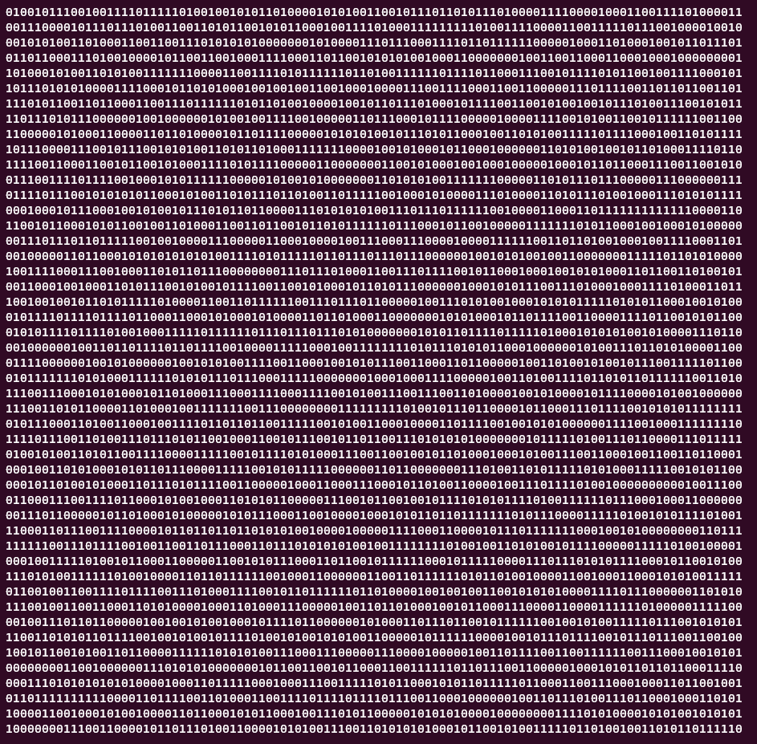

# FIPS140-1 

Go/Golang realization of cryptographic tests from  4.11.1 Power-Up Tests. 
The source for these tests is the paper: https://csrc.nist.gov/files/pubs/fips/140-1/upd1/final/docs/fips1401.pdf

## Random sequence generator

This library includes a function for the generation of random 20 000 bits sequences. 
Example of usage: 
```
randset := fips140.GetRandomSet(20000)
```
You also can see your random sequence by calling this function:
```
fmt.Println(fips140.PrintAllBits(randset))
```
Example of output:


## The Monobit Test

Count the number of bit 1 or bit 0 in the 20,000-bit stream. The test is passed if values in [9654, 10346]

Example of usage:
```
monobit := fips140.Monobit(randset)
fmt.Println("The Monobit Test -> ", monobit)
// Output: The Monobit Test ->  true
```

## The Long Run Test

Find the max streak of the same bits. The test is passed if this value < 34. By this library, you also can get these sequences from function.

Example of usage:
```
longrun, streak := fips140.LongRun(randset)
fmt.Println("The Long Run Test -> ", longrun, "| streak for this set = ", streak)
// The Long Run Test ->  true | streak for this set =  12
```

## The Poker Test

Divide our 20,000 bits on blocks by 4 bits. Count each 4 bits number and use this formula:

Test is passed when 1.03 < x < 57.4

Example of usage:
```
pokerTest := fips140.Poker(randset)
fmt.Println("The Poker Test -> ", pokerTest)
```

## The Runs Test

A run is defined as a maximal sequence of consecutive bits of either all ones or
all zeros, which is part of the 20,000 bit sample stream. The incidences of runs
(for both consecutive zeros and consecutive ones) of all lengths (≥ 1) in the
sample stream should be counted and stored.
The test is passed if the number of runs that occur (of lengths 1 through 6) is
each within the corresponding interval specified below. This must hold for both
the zeros and ones; that is, all 12 counts must lie in the specified interval. For
the purpose of this test, runs of greater than 6 are considered to be of length 6

```
Length of Run   Required Interval
1  2267-2733
2  1079-1421
3  502-748
4  223-402
5  90-223
6+ 90-223
```

Example of usage:
```
longsequence, curSequenceTable := fips140.Runs(randset)
fmt.Println("The Runs Test -> ", longsequence, "| table for this set = ", curSequenceTable)

// Output: The Runs Test ->  true | table for this set =  map[1:2533 2:1243 3:634 4:340 5:137 6:155]
```